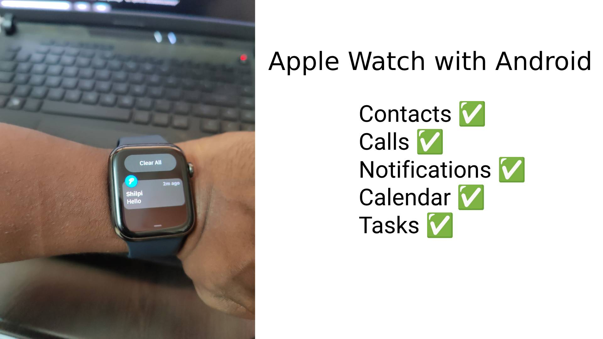

# Apple Watch with Android

This project aims to make Apple Watch usable with an Android Phone.

Read about the motivations here - https://abishekmuthian.com/apple-watch-with-android/ .

Go inside individual folders to get more information.

_Note: Unfortunately due to Apple's walled garden approach it's impossible to setup Apple Watch without an iPhone, but by using the code and techniques detailed in this project Apple Watch is usable with an Android phone without having to carry the iPhone along._

### What Works

- Notifications
- Contacts
- Calls
- Calendar
- Tasks

### What doesn't work

- SMS
