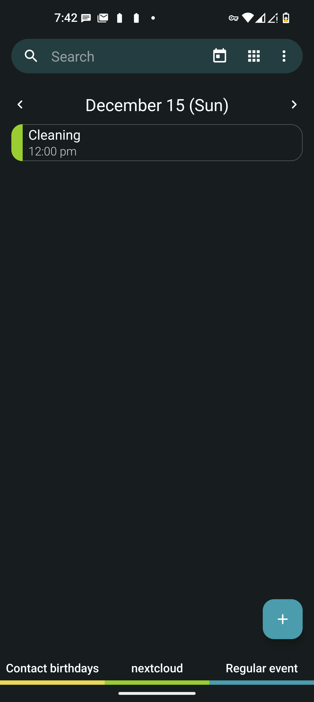
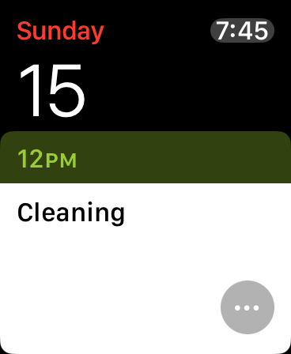

# Sync calendar from android to Apple Watch

With this setup we'll sync calendar from Android to iOS on iPhone with which the apple watch is paired. Then with a cellular Apple Watch we need not carry the iPhone with us.

## Requirements

1. [Nextcloud](https://nextcloud.com/) server.
2. Nextcloud client app on Android.
3. [Davx](https://www.davx5.com/) on Android.
4. CalDAV supported android contacts app, I use [Fossify Calendar](https://github.com/FossifyOrg/Calendar).
5. iPhone and Apple Watch paired with it.

## How To

1. Setup or get a Nextcloud server instance.
2. Follow the [Sync with Android guide](https://docs.nextcloud.com/server/30/user_manual/en/groupware/sync_android.html#contacts-and-calendar).
3. Follow the [Sync with iOS guide](https://docs.nextcloud.com/server/30/user_manual/en/groupware/sync_ios.html#calendar).
4. Enable CalDAV in the calendar app.

_Note: Fossify calendar app supports only syncing events with CalDAV and [not tasks](https://github.com/FossifyOrg/Calendar/issues/36). For syncing Tasks with Apple Watch refer to [Tasks Folder](/tasks/README.md)._

When done successfully all the calendar events from android will be synced in real-time with iOS and thereby on Apple Watch OS.

## Demo

Calendar event on Android

Calendar event synced on Apple Watch

