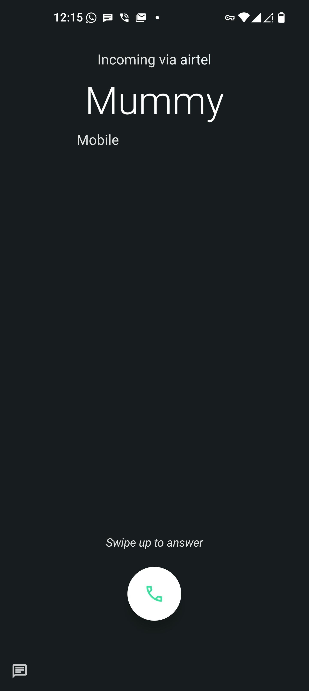

# Getting Calls on Apple Watch with Android phone

With cellular Apple Watch it's possible to receive & make calls even without the paired iPhone nearby.

## Requirements

1. Apple Watch with Cellular.
2. iPhone to pair with the Apple Watch.

## How to

1. Put the SIM from android phone in the iPhone.
2. Pair the Apple Watch with the iPhone.
3. Set up the [mobile data with Apple Watch](https://support.apple.com/en-in/119601).
4. Remove the SIM from iPhone and put it back on android phone.

If successful you will start receiving the calls on Apple Watch when the iPhone is not nearby.

_Note: Since the SIM is not on the iPhone, SMS facilities won't work and therefore SOS messages will not be sent either, even if that contact has an iMessage id; SOS emergency calls will work._

## Demo

Call received on both Android phone and Apple Watch simultaneously

