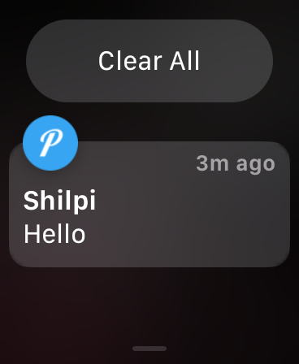

# Send Notifications to Apple Watch from Android

This implementation will send notifications from Android to Apple Watch.

## Requirements

1. [Termux](https://termux.dev/en/) on Android.
2. [Termux Boot](https://wiki.termux.com/wiki/Termux:Boot) on Android.
3. [Pushover](https://pushover.net/) on an iPhone & Apple Watch(installed automatically) paired with it.

## Caveats

- Since Pushover receives the messages on iPhone and then sends it to Apple Watch it needs to be always on and connected to the Internet. The iPhone need not be carried with us.

## How to

1. Install Termux and Termux-Boot on Android.
2. Install Pushover on iPhone. Create an account on the website, create an application to get the API token and the user token.
3. Connect to the Termux instance [via SSH](https://wiki.termux.com/wiki/Remote_Access#Using_the_SSH_server).
4. Create `boot` folder in `~/.termux/`.

```
$ cd .termux
$ mkdir boot
```

5. Run `termux-setup-storage` on Termux.
6. Create the folders `termux-scripts/apple-watch-to-android/` in the storage.

```
$ cd storage
$ mkdir -p termux-scripts/apple-watch-to-android
```

7. Put `pushover.sh` in `~/.termux/boot`.
8. Put `pushover.py`, `package_name_blacklist.txt` in `termux-scripts/apple-watch-to-android/`.
9. Update the `token` and `user` in the `pushover.py` with API token and user token respectively.
10. Update `package_name_blacklist.txt` with package names of those apps which you don't want notifications from on Apple Watch.
11. Restart the Android Phone.
12. You'll see a foreground notification from Termux with wake-lock.

If everything goes as planned, you will start getting the android notification on your Apple Watch.

### Rotate the sent_ids.txt file

Set crontab to rotate the sent_ids.txt file every day at 12 AM

SSH into termux and run

```
$ pkg update
$ pkg install nano cronie termux-services
$ sv-enable crond crontab -e
```

Copy and paste the following into the editor

```
0 0 * * * rm /data/data/com.termux/files/home/storage/termux-scripts/apple-watch-to-android/sent_ids.txt && touch /data/data/com.termux/files/home/storage/termux-scripts/apple-watch-to-android/sent_ids.txt
```

press `ctrl + o` to save the file and `ctrl + x` to close the file.

## Demo



## Todo

1. Implement rotation of the sent_ids.txt file.
2. Performance and Efficiency improvements.

Issues & Discussions for the same are welcome.
