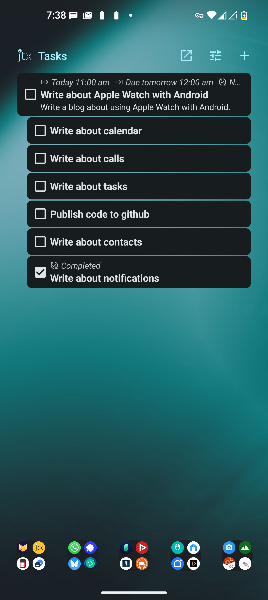
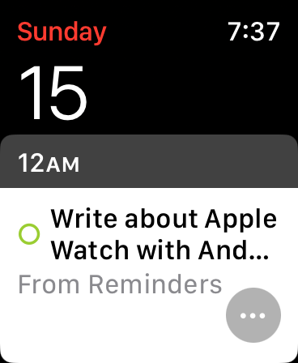
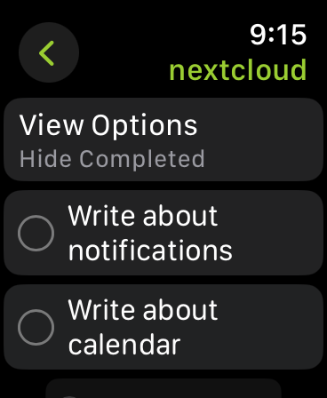

# Sync tasks from android to Apple Watch

With this setup we'll sync tasks from Android to iOS on iPhone with which the apple watch is paired. Then with a cellular Apple Watch we need not carry the iPhone with us.

## Requirements

1. [Nextcloud](https://nextcloud.com/) server.
2. Nextcloud client app on Android.
3. [Davx](https://www.davx5.com/) on Android.
4. [jtx Board](https://jtx.techbee.at/) on Android.
5. iPhone and Apple Watch paired with it.

## How To

1. Setup or get a Nextcloud server instance.
2. Enable Tasks support with jtx Board in the Davx app in android.
3. Follow the [Sync with Android guide](https://docs.nextcloud.com/server/30/user_manual/en/groupware/sync_android.html#contacts-and-calendar).
4. Follow the [Sync with iOS guide](https://docs.nextcloud.com/server/30/user_manual/en/groupware/sync_ios.html#calendar).

When done successfully tasks from jtx Board from android will be synced in real-time with iOS Reminder app and thereby on Apple Watch OS.

_Note: Main task from jtx are shown in the Calendar app on Watch OS and the sub-tasks are available on the Reminder app._

## Demo

jtx Tasks on Android

Tasks synced with Calendar on Apple Watch

Reminder app on Apple Watch

